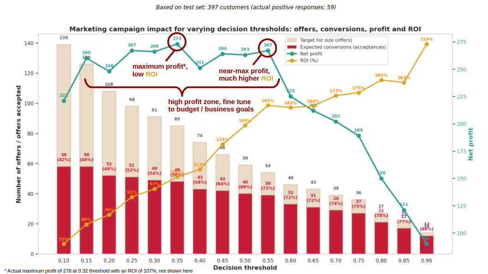

# Marketing analysis and predictive modelling

## Key business goals
_(from original [Data Analyst Case](https://github.com/datagranate/data-portfolio/blob/main/marketing/data/dictionaries/iFood%20Data%20Analyst%20Case.pdf))_

1. **Explore the data**  to provide the marketing team a better understanding of the characteristic features of respondents
2. **Create a predictive model** which allows the company to **maximise the profit** of the next marketing campaign
3. **Propose and describe a customer segmentation** based on customers' behaviours

**Strategic note:** While the business request for the predictive model is to optimise for **maximum net profit**, this project goes beyond a finding a single "optimal" threshold. Recognising that real-world campaigns are constrained by **budget**, **risk appetite**, and the need for **customer goodwill**, a comprehensive **trade-off analysis** is provided. This includes visualisations and tables allowing stakeholders to choose the best strategy, balancing profit, ROI and long-term brand health based on their specific constraints.

---

## Dataset
### Source and licence
- **Source:** [Kaggle: Marketing Data](https://www.kaggle.com/datasets/jackdaoud/marketing-data)
- **Licence:** [CC0: Public Domain](https://creativecommons.org/publicdomain/zero/1.0/)
- **Description:** ~2,000 rows each representing a customer of a food delivery app. Features include demographics (age, income, education, marital status, children at home), previous offer acceptance, aggregated transaction history (spend on various product types, recency), and channel usage (web, store, catalog). **Target variable:** `Response` (customer accepted latest offer). Note that the original dataset does not specify

### Pre-processing and data quality
The `marketing_cleaning.ipynb` notebook details the full data pipeline:

- **Duplicate handling:** Included dropping rows with contradictory `Response` values for identical customer data.
- **Date parsing:** Converted string dates to `datetime` objects.
- **Data validation:** Imputed missing values (eg `Income`) for EDA; capped outliers (1.5 IQR rule), and dropped rows with imputed age/income to ensure model integrity.
- **Feature engineering:** Created numerical proxies for categorical data (eg `Education_Years`) and calculated derived metrics (eg `SpendPerMonth`, `PercentGold`).

---

## Notebooks
| Notebook | Focus | Key output |
| :--- | :--- | :--- |
| `marketing_cleaning.ipynb` | Data cleaning and EDA | Data quality, initial insights, feature engineering |
| `marketing_ml.ipynb` | Predictive modelling | XGBoost model optimised for **net profit** (not just accuracy) |
| `marketing_segmentation.ipynb` | Customer profiling | **(to come)** Segment definitions and targetable personas  |

---

## Key Results and insights

### Exploratory data analysis (EDA)
- **Conversion rate:** ~15% of customers accepted the most recent offer
- **Top predictors:** **Recency** and **previous offer acceptance history** are the strongest signals for future acceptance
- **Demographics:** Respondents tend to have higher income, smaller households, and are long-standing customers with recent purchases
- **Channel behaviour:**
  - **Overall:** Store (46%) > Web (33%) > Catalog (21%)
  - **Respondents:** Show a higher propensity for **Catalog** purchases and fewer Store visits, suggesting they prefer browsing from home
  - **Web insight:** Positive responders often have *fewer* web visits but *higher* conversion per visit, indicating **intent-driven shopping** vs. speculative browsing. Overall, a *higher* number of web visits is correlated with lower Income, higher 'deals' purchases and more children/teens at home, likely to be visiting frequently to compare prices and hunt for deals.  These customers are are highly price-sensitive.
### Predictive model performance
- **Algorithm:** XGBoost Classifier (selected over Random Forests for higher precision on the minority class).
- **Optimisation goal:** **Maximise net profit** (*revenue per conversion* minus *cost per offer*), not just accuracy
- **Performance on test set (397 customers):**
	- **Net profit:** **278** (at optimal threshold, using customer profit scoring)
  	- **Optimal threshold:** **0.32** (send offers only if predicted probability > 32%)
	- **Precision:** **0.56** (56% of offers sent resulted in acceptance)
	- **Recall:** **0.83** (identified 83% of all potential accepters)
	- **F1 score:** **0.67**
	- **AUC-ROC:** **0.94**
- **Top 5 features (SHAP):**
	1. _Low_ **`Recency`** (days since last purchase)
	2. **`NumAccepted`** (previous offers accepted)
	3. **`DaysSinceJoin`** (customer tenure)
	4. **`TotalSpend`** (historical spend)
	5. _One_ **`AdultHome`** (single/divorced/widowed households vs married/together)

#### Model limitations and future work
The current model relies heavily on behavioural features (eg `NumAccepted`, `DaysSinceJoin`, purchase history) that are **unavailable for new customers**.  Therefore I recommend the following future work:

- Build a separate model for **new customers** using only static features (eg demographics, onboarding data)
- Explore transfer learning or feature engineering to bridge the gap between new and existing customers

### Customer segmentation insights
*(Pending final segmentation notebook, but based on EDA and SHAP:)*

- **The "Loyal Browsers":** High `TotalSpend`, high `NumAccepted`, low `Recency`. **Action:** Target with exclusive catalog offers
- **The "Window Shoppers":** High `NumWebVisits`, low `NumWebPurchases`, high `Recency`. **Action:** Target with time-sensitive web-only discounts
- **The "High-Risk, High-Reward":** High `Income`, high `PercentGold`, but low `NumAccepted`. **Action:** Test premium offers to convert them

---

## Strategic recommendations for Marketing team

The model provides a data-driven framework for optimising campaign spend, but real-world marketing must balance **immediate profit** with **ROI** and **long-term brand health**.

### 1. The Profit vs ROI trade-off (risk and budget)
The model identifies a threshold that maximises **total net profit** as requested, but the marketing team may prefer a slightly lower profit with significantly **higher ROI** if budget is constrained or risk appetite is low.  For the test set of 397 customers and a decision threshold granularity of 0.05, this would be:
- **Max profit strategy (threshold 0.35):** Targets ~225 customers, yielding **273 profit** (ROI 107%). Best for: *Aggressive growth, flexible budgets.*
- **Max efficiency strategy (threshold 0.55):** Targets fewer customers, yielding **267 profit** (ROI 165%). Best for: *Risk-averse campaigns, tight budgets, or when optimising for return on every unit spent.*

### 2. The goodwill strategy (long-term retention)
While the model suggests *not* sending paid offers to customers with a predicted probability < 0.35, completely ignoring them risks "message fatigue" if they are contacted too often with irrelevant offers. Instead, a **tiered engagement strategy** should be adopted:
- **High-probability (P > 0.55):** **Target with paid offers.** Maximise ROI with high-value incentives.
- **Medium-probability (0.35 < P < 0.55):** **Target with paid offers** if budget allows. Maximise total profit.
- **Low-probability (P < 0.35):** **Do not send paid offers.** Instead, include them in a **low-cost brand nurture campaign** (eg email newsletters, product tips, or "thank you" messages). This maintains goodwill and brand recall without incurring the ~3MU cost of a likely-failed offer.

### 3. Frequency capping 
Regardless of the model's prediction, implement **cross-channel frequency capping** (eg max 1 paid offer per customer per 30 days) to prevent fatigue and protect brand perception. This ensures that even "high-probability" customers are not overwhelmed by excessive messaging.

### 4. Focus on "intent-driven" channels
- **Why:** Respondents have fewer web visits but higher conversion per visit.
- **Action:** Reduce spend on "browse-heavy" channels (eg generic web banners) and shift budget to **catalog mailers** and **targeted email offers** for high-intent users.

### 5. Monitor churn risk" via recency
- **Why:** `Recency` is the #1 driver of acceptance.
- **Action:** Implement a **real-time trigger**: If a customer hasn’t purchased in >30 days, automatically add them to the "high-priority" list for the next campaign.

---

## How to Run
**Clone the repository:**

`git clone https://github.com/datagranate/data-portfolio.git`
   
**Install dependencies:**
 
 `pip install -r requirements.txt`
 
**Run the notebooks:**

`cd marketing`
 
Start with `marketing_cleaning.ipynb` to reproduce the data pipeline.

Then run `marketing_ml.ipynb` to train the model and generate insights.

   
